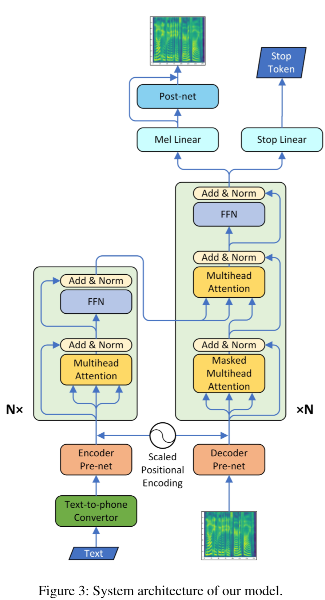

# Transformer-TTS
TTS model based on Transformer.

Follow [Neural Speech Synthesis with Transformer Network](https://arxiv.org/abs/1809.08895)

Follow [The Implementation of Transformer based on Pytorch](https://github.com/jadore801120/attention-is-all-you-need-pytorch)

Model shown as follow:

## Train
1. Put [LJSpeech dataset](https://keithito.com/LJ-Speech-Dataset/) in `data`.
2. Run `preprocess.py`
3. Run `train.py`

## Dependencies
- python 3.6
- pytorch 1.1.0
- numpy 1.16.2
- scipy 1.2.1
- librosa 0.6.3
- inflect 2.1.0
- matplotlib 2.2.2
